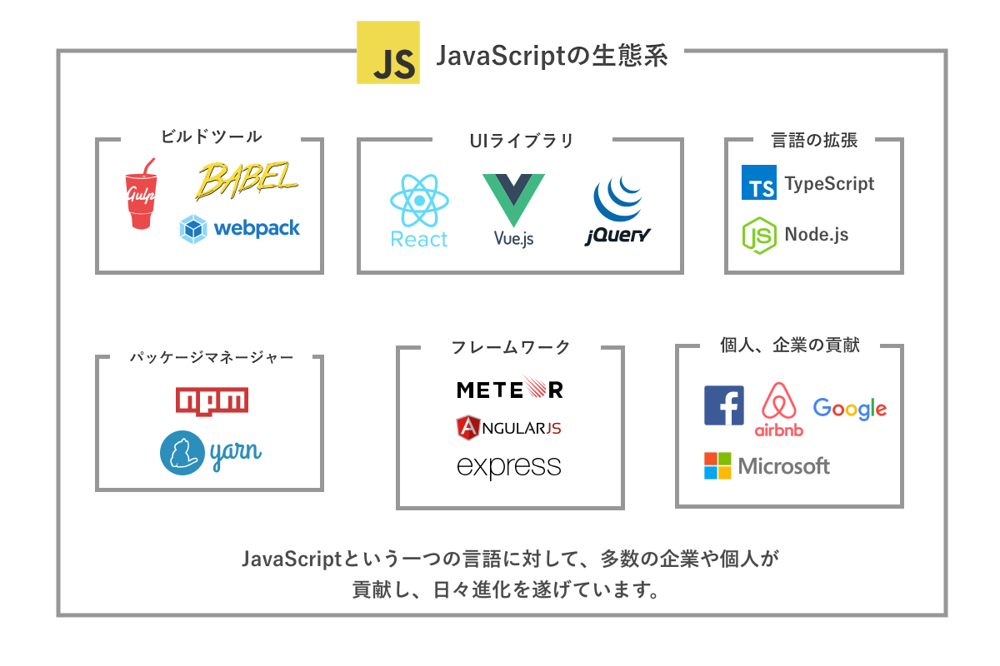
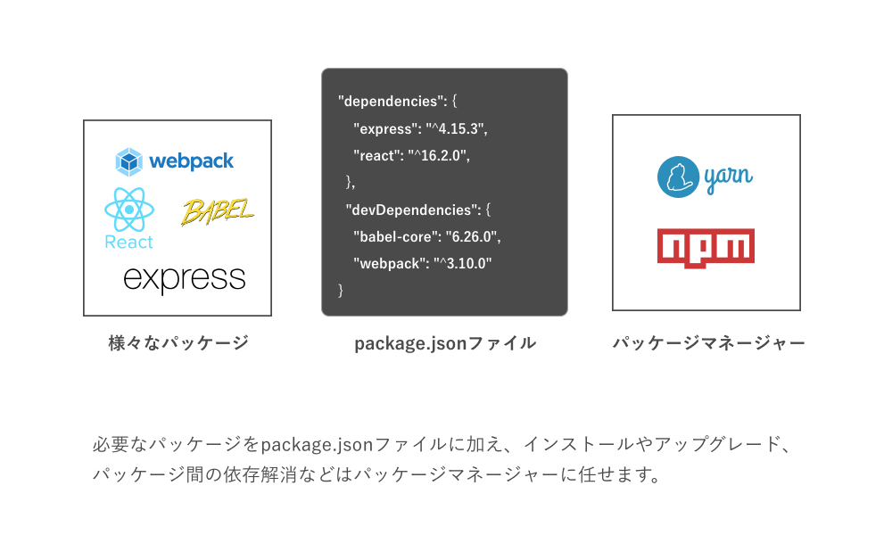
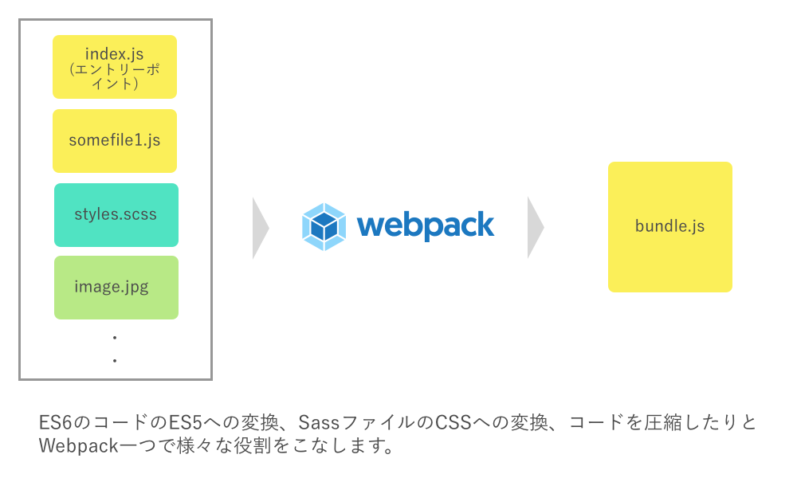

# Lesson 1. Webアプリケーション開発とJavascript

## 目的

- NPMについて理解する。
- Yarnを使ったパッケージ操作を覚える。
- Webpackの基本を知る。
- 応用編を進めていく準備を整える。

## プログラミング言語の生態系



それぞれのプログラミング言語は、その言語を利用するプログラマ達がWebサイト作成用のフレームワークを開発したり、再利用性の高いプログラムをまとめたプラグインやライブラリを作ったりすることで、より便利になり、より多くのプログラマを巻き込んでいくようになります。これを植物や動物など様々なものが組み合わさって構成される自然の生態系になぞらえて、プログラミング言語の生態系と呼びます。以下で紹介するパッケージマネージャーのNPMやYarn、ReactやAngularといったライブラリはJavascriptの生態系の中で生まれてきたものです。

## クライアントサイドJavascriptとサーバーサイドJavascript(Node.js)

一般的にWebサイトにおいてユーザーのブラウザ内で動いているコードのことをクライアントサイドプログラム、ブラウザではなく外部のサーバーで動いているプログラムのことをサーバーサイドプログラムと呼びます。Javascriptはもともとブラウザの中でのイベントを処理するために生まれた言語です。しかし、2009年にNode.jsが登場して以降、徐々にサーバーサイド側でJavascriptが使われていることが増えてきました。今ではNetflixやPayPalなど多くの企業がサーバーサイドの主要言語の一つとして利用されています。また最近では、更に進化が進みElectronというライブラリを使うと、デスクトップ用のアプリケーションが開発出来たり、React Nativeというライブラリを使うとiOSやAndroid向けのアプリを作ることが出来るようになっています。このように、JavaScriptの利用範囲が広がっているためクライアントサイドJavaScriptをマスターすると、多くのことが出来るようになります。

## パッケージマネージャー

### パッケージとは

パッケージとは、再利用可能なコードをひとまとめにしたものを指します。例えばユーザーの登録やログインの機能は多くのウェブサイトが持っていますが、これを一人ひとりのプログラマが毎回実装するのは、時間がかかるだけでなく、セキュリティ面で問題が出たり、バグが多くなったりと問題が発生しやすいです。そのため、こうしたものはどんどんとパッケージ化されてオープンソースとして公開されています。

### パッケージマネージャーとは



パッケージが増えてくると、例えばパッケージがアップデートされた時の対応を行ったりといった作業が大変です。こうした作業を簡単に出来るようにするための仕組みがパッケージマネージャーです。JavaScriptのプロジェクトではpackage.jsonというファイルを通してパッケージを管理します。

## NPM

Node.jsにおいてデフォルトのパッケージマネージャーとなっているのがNPMです。

**1. Node.js、NPMのインストール**

npmを利用するにはnode.jsをパソコンにインストールする必要がありますので、以下のリンクよりインストールを行って下さい。インストールのページには2つインストールのリンクがあるので左側の安定版を選んで下さい。

- [Node.jsのインストール](https://nodejs.org/ja/)

インストールが完了したらバージョンを確認してみましょう。

```bash
$ node -v
v8.11.3

$ npm -v
5.6.0 

// 出力結果はインストールされているバージョンで異なります。
```

**2. package.jsonファイルの作成**

これで準備が整ったので実際に試してみましょう。先ほど述べたとおり、JavaScriptのプロジェクトではpackage.jsonというファイルを通してパッケージ管理を行います。package.jsonは`npm init`というコマンドで生成することが出来ます。(自分で作成しても良いのですが自動生成のほうが楽です。)

```bash
$ mkdir npm-test
$ cd npm-test
$ npm init
This utility will walk you through creating a package.json file.
It only covers the most common items, and tries to guess sensible defaults.

See `npm help json` for definitive documentation on these fields
and exactly what they do.

Use `npm install <pkg>` afterwards to install a package and
save it as a dependency in the package.json file.

Press ^C at any time to quit.
package name: (npm-test) 

以下インタラクティブに設定が出来ます。
```

設定をインタラクティブにするのが面倒という場合でしたら`npm init -y`として、後から設定するのが良いでしょう。デフォルトのpackage.jsonファイルは以下のようになるはずです。

```bash
$ cat package.json
{
  "name": "npm-test",
  "version": "1.0.0",
  "description": "",
  "main": "index.js",
  "scripts": {
    "test": "echo \"Error: no test specified\" && exit 1"
  },
  "keywords": [],
  "author": "",
  "license": "ISC"
}
```

**3. NPMパッケージのインストール**

package.jsonファイルが生成出来たら、パッケージをインストールしてみましょう。ここでは試しにlodashというパッケージをインストールしてみます。インストールには`npm install (パッケージ名)`というコマンドを使います。

```bash
$ npm install lodash
npm notice created a lockfile as package-lock.json. You should commit this file.
npm WARN npm-test@1.0.0 No description
npm WARN npm-test@1.0.0 No repository field.

+ lodash@4.17.4
added 1 package in 1.822s
```

インストールが完了すると、npm-testディレクトリ内にnode_modulesというフォルダが新しく作成されていることに気づくはずです。このnode_modeulsというフォルダにインストールしたパッケージと、それに関連するパッケージ(依存パッケージ)が保存されていきます。

パッケージは一つだけでなく複数インストールすることも可能です。例えばreactとreduxという2つのパッケージをインストールするには次のようにします。

```bash
$ npm install react redux
```

インストールが完了したらpackage.jsonを見てみましょう。"dependencies"以下の部分にインストールしたパッケージとそのバージョンが追加されているはずです。

```bash
$ cat package.json
{
  ...
  "dependencies": {
    "lodash": "^4.17.4",
    "react": "^16.2.0",
    "redux": "^3.7.2"
  }
}
```

## Yarn

Yarnは、Facebookによって開発されたnpmと互換性のあるパッケージマネージャーです。NPMに比べてパッケージのインストール速度が早い点、パッケージのバージョンを固定しやすい点などがメリットとしており、現在ではnpmではなくyarnをメインで利用するのが主流となっています。CodeGritにおいても基本的にnpmではなくyarnを利用していきます。

**1. Yarnのインストール**

npmの説明の部分では省略しましたが、インストールするパッケージにはグローバルパッケージとローカルパッケージの2つの種類があります。先ほどのnpmの例ではローカルパッケージをインストールしました。これらのローカルパッケージは、一つのプロジェクト内のみで利用されます。それに対してグローバルパッケージでは、一つのプロジェクトだけではなく複数のプロジェクトで共用することが出来ます。Yarnパッケージは複数のプロジェクトで利用するのでグローバルパッケージとしてインストールします。グローバルパッケージのインストールは`-g`というオプションを付けて`npm install -g (パッケージ名)`というコマンドで出来ます。

```bash
$ npm install -g yarn
added 1 package in 1.225s
$ yarn --version
0.24.5
```

これでYarnのインストールが完了しました。

**2. Yarnを利用してpackage.jsonを生成**

npmと同様にyarnでも`yarn init`というコマンドを利用することでpackage.jsonを作成することが出来ます。

```bash
$ mkdir yarn-test
$ cd yarn-test
$ yarn init -y
yarn init v0.24.5
warning The yes flag has been set. This will automatically answer yes to all questions which may have security implications.
success Saved package.json
✨  Done in 0.08s.

$ cat package.json
{
  "name": "yarn-test",
  "version": "1.0.0",
  "main": "index.js",
  "license": "MIT"
}
```

**3. yarnを利用してNPMパッケージをインストールする**

yarnを利用してパッケージをインストールするには`yarn add (パッケージ名)`というコマンドを利用します。npmと同様に複数パッケージを指定できます。

```bash
$ yarn add lodash react redux
yarn add v0.24.5
[1/4] 🔍  Resolving packages...
[2/4] 🚚  Fetching packages...
[3/4] 🔗  Linking dependencies...
[4/4] 📃  Building fresh packages...
success Saved lockfile.
...
✨  Done in 6.62s.
```

**4. グローバルパッケージをインストールする**

yarnを利用してグローバルパッケージをインストールするには`yarn global add (パッケージ名)`というコマンドを利用します。ここではparcelというビルドツールを試しにインストールしてみましょう。

```bash
$ yarn global add parcel-bundler
...
✨  Done in 19.35s.
```

## ビルドツール



HTML/CSSコースでは、Sassを利用してCSSを書く方法を学びました。このSaasで書いたコードはブラウザは認識してくれませんので、CSSへとトランスパイルする必要があります。ES6のコードもブラウザによってはまだ対応が遅れている場合もあるため、Babelというライブラリを利用してES5のコードへのトランスパイルすることが必要です。

またWebサイトを本番環境に公開するときにはページの表示スピードが早くなるようにJavascriptのコードを一つにまとめたり、ファイルを圧縮してファイルサイズを小さくするようにする必要があります。こうした作業を一つ一つ手作業でやるのは大変ですし、作業を抜かしてしまう可能性もあります。そこでビルドツールを使ってコマンド一つで複数の作業を自動で行えるようにしていきます。

よく利用されるビルドツールには最近まで主流だった、**Gulp**や、先ほどインストールした**Parcel**、そして現在最も人気の高い**Webpack**などがあります。

CodeGritではWebpackを利用していきますが、Webpackのメリットを理解するのは、Javascriptの勉強を先に進めてからが良いでしょう。そのため、ここでは基本的な使い方のみ解説します。

**1. Webpackのインストール**

先ほどのyarn-testというプロジェクトにWebpackを追加します。

```bash
$ yarn add --dev webpack
...
✨  Done in 26.41s.
```

**2. ファイルの追加**

yarn-testディレクトリ内にsrcというディレクトリを作成し、その中にindex.jsというファイルを加えます。またindex.htmlというファイルをプロジェクト直下に作成します。

```bash
$ touch index.html
$ mkdir src
$ touch src/index.js
$ ls
index.html		package-lock.json	src
node_modules		package.json		yarn.lock
```

**3. index.htmlの編集**

index.htmlを以下のように編集して下さい。

```html
<!DOCTYPE html>
<html>
<head>
  <meta charset="UTF-8">
</head>
<body>
  <div id="main"></div>
  <button id="button1">Click</button>
  <script src="./dist/bundle.js"></script>
</body>
</html>
```

**4. index.jsの編集**

先ほどインストールしたlodashを使ってみましょう。lodashはユーティリティライブラリと言われるもので配列やオブジェクト、Stringの操作に利用できる便利な関数が多く定義されています。インストールしたパッケージは`import (任意の名称) from 'ライブラリ名';`としてインポートすることが出来ます(Unit1のモジュールのレッスンも参考にしてください。)。lodashは慣習的に`_`という名称を使います。

```javascript
import _ from lodash; // lodashのインポート

/* 
0から10の間の数字をランダムで表示するファンクション
*/
function addRandomNum() {
  const mainEl = document.getElementById('main');
  let p = document.createElement('p');
  p.innerHTML = _.random(0, 10).toString();
  document.body.appendChild(p);
}

/*
ボタンがクリックされる度にaddRandomNumを呼び出すようにする即時関数。
*/
{
  const button1 = document.getElementById('button1');
  button1.addEventListener("click", addRandomNum);
  console.log("Ready");
}
```

**5. webpackのコンフィグファイルの設定**

さて上記の通りファイルを作成しましたが、index.jsファイルはES6で書かれているためそのままでは動きません。そのためWebpackを利用してES5にトランスパイルする必要があります。トランスパイルされたファイルは**build**というディレクトリ内に**bundle.js**という名前で保存します。

これを自動的に行ってくれるようにwebpackのコンフィグファイルを設定します。まずは**webpack.config.js**というファイルをプロジェクト直下に作成します。

```bash
$ touch webpack.config.js
$ atom ./webpack.config.js
```

ファイルが開いたら以下のように入力して下さい。

```javascript
// ファイルやディレクトリを操作するためのユーティリティパッケージpathを利用します。
const path = require('path'); 

module.exports = {
  mode: 'development', // ①
  entry: './src/index.js', // ②
  output: { // ③
    filename: './bundle.js', // ④
    path: path.resolve(__dirname, 'dist') // ⑤
  }
};
```
- ① モードを開発モードに設定

開発モードを適用することで、ブラウザのChrome Developer Toolsを使ってのデバッグがしやすくなります。

- ② エントリーポイントの指定

エントリーポイントは、プロジェクトのルートとなる場所です。entryポイントは複数設定することも出来ますが、今回の場合はindex.jsファイルのみを指定します。

- ③ 出力先の設定

トランスパイルされたファイルをどこに出力されたかを指定します。

- ④ 出力されるファイル名の指定

今回はbundle.jsという名前で保存するので、それをそのまま入力します。

- ⑤ path.resolve(__dirname, 'dist')

pathモジュールを使用して、現在いるディレクトリの下のdistというディレクトリ内を基準パスとします。

**6. Webpackでのビルドを実行する**

準備ができましたので、実際にトランスパイルしてみましょう。

```bash
$ node_modules/.bin/webpack
Hash: ae02219f23c45de6eee1
Version: webpack 3.10.0
Time: 430ms
      Asset    Size  Chunks                    Chunk Names
./bundle.js  544 kB       0  [emitted]  [big]  main
   [0] ./src/index.js 362 bytes {0} [built]
   [2] (webpack)/buildin/global.js 509 bytes {0} [built]
   [3] (webpack)/buildin/module.js 517 bytes {0} [built]
    + 1 hidden module
```

これで、ビルドが完了しました。プロジェクト直下にdistというディレクトリが作成されて、その中のbundle.jsというファイルにトランスパイルされたコードが保存されているのが確認出来るはずです。

**7. index.htmlをブラウザで開く**

ビルドが完成したら、ブラウザで動作確認してみましょう。ボタンをクリックしてランダムに数字が追加されていくのが確認出来たら成功です。

**8. `hot module replacement`を使う**

さて、無事にビルドは出来ましたが開発中に、毎回毎回`node_modules/.bin/webpack`というコマンドを入れてビルドするのは面倒です。そこで、Webpackにはほっとモジュールリプレイスメントという機能があります。これは、エントリーポイントとインポートされているモジュールの変更をWatch(監視)し、変更が行われる度に自動で即座に再ビルドをしてくれる仕組みです。これを有効にするための設定をしましょう。

1. webpack-dev-serverのインストール

```bash
$ yarn add --dev webpack-dev-server
```

2. コンフィグファイルの設定

webpack-dev-serverをインストールしたら、コンフィグファイルを編集しましょう。

```javascript
const path = require('path');
const webpack = require('webpack');

module.exports = {
  entry: './src/index.js',
  output: {
    filename: './bundle.js',
    path: path.resolve(__dirname, 'dist')
  },
  devServer: {　// ①
    hot: true,
    hotOnly: true,
    watchContentBase: true,
    watchOptions: {
      ignored: /node_modules/
    }
  },
  plugins: [ // ②
    new webpack.HotModuleReplacementPlugin()
  ],
};
```

- ① Webpack Dev Serverの設定

Webpack Dev Serverには、設定できるオプションが多数あります。ここでは、hot module replacementのための基本的なものを設定しています。

- ② Hot Module Replacement Pluginを追加

WebpackのHot Module Replacement Pluginを有効にしています。

**9. 実行する**

設定が出来たら実行してみましょう。

```
$ node_modules/.bin/webpack-dev-server
Project is running at http://localhost:8080/
...
webpack: Compiled successfully.
```

サーバーが無事立ち上がったら、`http://localhost:8080/`にアクセスして見て下さい。プログラムが動いているのが確認出来るはずです。確認が出来たら、index.jsのファイルを試しに変更してみましょう。変更が行われる度に自動的にコンパイルを行ってくれるのが分かるはずです。

### NPMスクリプト

Webサイトの作成には、開発環境(development)、公開前環境(staging)、本番前環境(production)など様々なステージがあります。例えば、本番環境ではクラウド上に画像やCSSファイルをアップロードしたいかもしれません。こうした時にターミナル上で毎回必要なコマンドを打つのは面倒な上、ミスが発生しがちです。こうしたコマンドをNPMスクリプトを利用して簡単に実行出来るようにすると便利です。今回は試しにWebpackのコマンドをNPMスクリプト化しましょう。

1. package.jsonにスクリプトを追加する。

package.jsonを開いて、"dependencies"の部分の前に以下を追加しましょう。

```json
...
"scripts": {
  "dev-server": "webpack-dev-server"
},
"dependencies": {
...
```

2. スクリプトを実行する

追加したスクリプトは以下のようにして実行出来ます。すると、先ほどコマンドラインからwebpack-dev-serverを実行した際と同じようにサーバーが立ち上がります。

```bash
$ yarn run dev-server
...
webpack: Compiled successfully.
```

Yarn及びWebpackの設定のサンプルコードはこちら: 

[js-unit02-lesson01-sample01](https://github.com/codegrit-jp-students/js-unit02-lesson01-sample01)

## チャレンジ

[チャレンジ1](./challenge/README.md)

## 更に学ぼう

### 記事で学ぶ

- [NPM公式(英語)](https://www.npmjs.com/)
- [Yarn公式](https://yarnpkg.com/ja/)
- [Webpack公式](https://webpack.js.org/)
